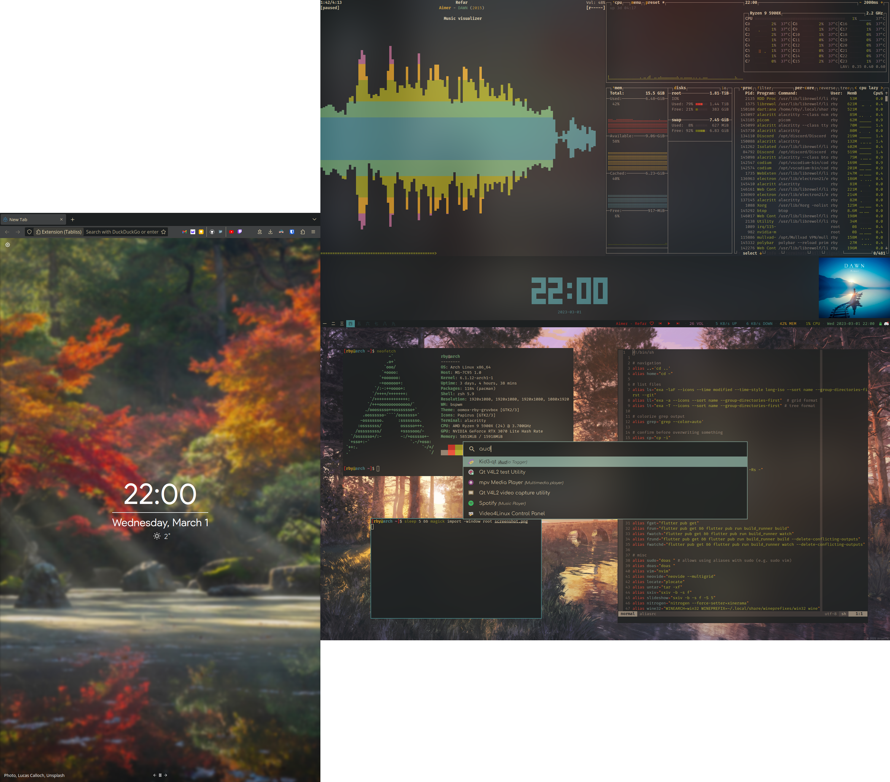
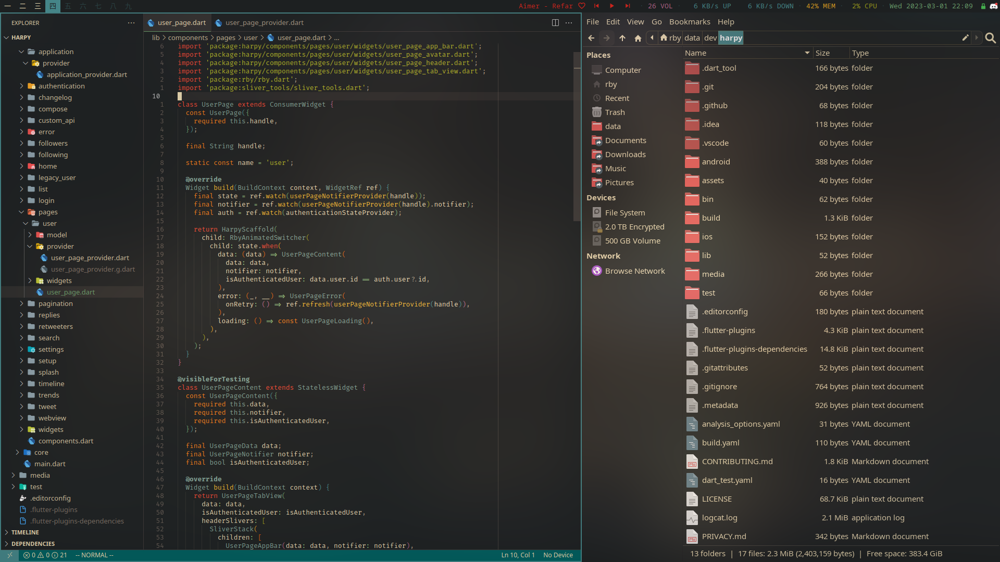

# dotfiles

dotfiles for my arch linux setup

- wm: **bpswm**
- bar: **polybar**
- terminal: **alacritty**
- shell: **zsh**
- application launcher: **rofi**
- notification manager: **dunst**
- compositor: **picom** ([fork with blur & rounded borders](https://aur.archlinux.org/packages/picom-ibhagwan-git))
- sans-serif font: **noto sans**
- monospace font: **fira code**
- editor: **neovim** / **vscodium**
- file manager: **thunar**
- browser: **librewolf**
- pdf reader: **zathura**
- mpd client: **ncmpcpp**
- top: **btop**






### installation

```sh
git clone --bare "https://github.com/robertodoering/dotfiles" $HOME/.dotfiles
alias dotfiles="git --git-dir=$HOME/.dotfiles/ --work-tree=$HOME"
dotfiles checkout
```
